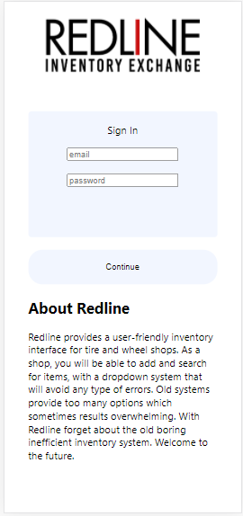
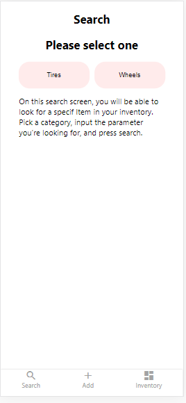
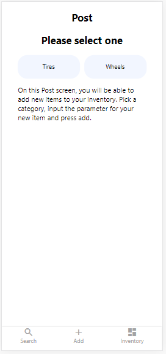
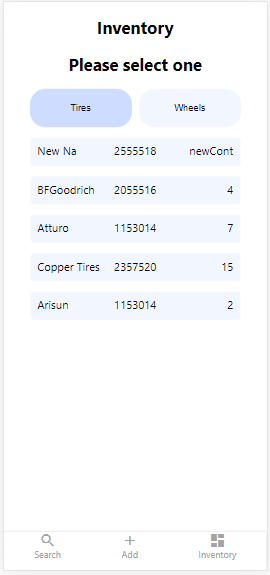
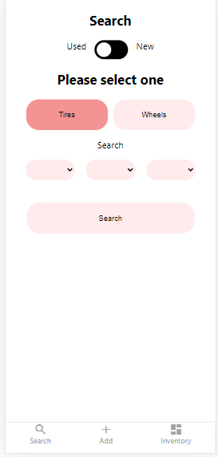

This app will allow tire & wheel shop owners a more efficient way to keep up with what they have in stock.
A very modern and user-friendly interface with a powerful and organized storage system. I created this app
because as someone who has worked in this industry I notice a great need for modernization and better organization of their inventory system. I created this app thinking about how to make a simple and useful way to keep up.

Link to live demo : https://redline.vercel.app/

API: 'https://mighty-oasis-55773.herokuapp.com'

SnapShots:

  

  

##### App Explanation

This app lets the user add tires by specific sizes brands and condition either new or used. Also, it let the user add OEM wheels or custom wheels by make model and year.
The user can also look for used tires, new tires, OEM wheels, and Custom wheels by a selection done on dropdowns which avoid the issue or typos which are very frequent on used technologies. Finally, It, let the user look at their inventory and the information related to every item.

#### API Description

This API generates all the options that a user can pick from when creating items into his/her tire and wheel inventory.
It populates drop downs with the specific option so they cannot input wrong information. It enable the user to create new item (tires/wheels) and also provides a way to easy find them when it is needed

### Technologies

Front-end: Javascrip, React, CSS, JSX, React Hooks, HTML5
Back-end: Node.js, Express.js, Mocha, Chai, RESTful API Endpoints, Postgres
Development Environment: Heroku, Vercel

### End Points

## api/tires

Method: GET
Description: It will return an object with all tire sizes divided in three different arrays,
brand names, and quantities.

Response: {
"tireSize": {
"width": [
"",
"105",
"115",
"125",
"135",
"145",
"155",
"165",
"175",
"185",
"195",
"205",
"215",
"225",
"235",
"245",
"255",
"265",
"270",
"275",
"285",
"295",
"305",
"315",
"325",
"335",
"345",
"355",
"365",
"375",
"385",
"405",
"480",
"530",
"570",
"670",
"690",
"700"
],
"ratio": [
"",
"25",
"30",
"35",
"40",
"45",
"50",
"55",
"60",
"65",
"70",
"75",
"80",
"85"
],
"diameter": [
"",
"13",
"14",
"15",
"16",
"17",
"18",
"19",
"20",
"21",
"22",
"24",
"26",
"28"
]
},
"tireBrands": [
"",
"Arisun",
"Arizonian",
"Atturo",
"Barum",
"BFGoodrich",
"Braven",
"Bridgestone",
"Carlisle",
"Coker Tire",
"Continental",
"Copper Tires",
"Corsa",
"Dunlop",
"Ezgo",
"Falken",
"Fierce",
"Firestone",
"GBC",
"General Tire",
"Gladiator",
"GMZ",
"Goodyear",
"GT Radial",
"Hankook",
"Hartland",
"Interco",
"Kanati",
"Kumho",
"Laufenn",
"Maxxis",
"Michelin",
"Mickey Thompson",
"Milestar",
"Mohave",
"Journey",
"Nankang",
"Nexen",
"Nitto",
"Nokian",
"Ohtsu",
"Pathfinder",
"Phantom",
"Pirelli",
"Pitbull",
"Pro comp",
"Rage",
"Road Hugger",
"Sentury",
"Taskmaster",
"Tensor Tire",
"Toyo Tires",
"Trailfinder",
"Uniroyal",
"Vision",
"Vogue Tyres",
"West Lake",
"Yokohama",
"Other"
],
"quantity": [
"",
"1",
"2",
"3",
"4",
"5",
"6",
"7",
"8",
"9",
"10",
"11",
"12",
"13",
"14",
"15",
"16",
"17",
"18",
"19",
"20",
"21",
"22",
"23",
"24",
"25"
]
}

## api/tires/all

Medthod: GET
Description: It will return an objects with all the tires that exist currently in the user's inventory
Response:
[
{
"id": 1,
"brand": "Coker Tire",
"size": "1957021",
"quantity": "14",
"condition": "used",
"modified": "2020-11-09T01:58:06.981Z"
},
{
"id": 2,
"brand": "Coker Tire",
"size": "1956520",
"quantity": "8",
"condition": "used",
"modified": "2020-11-09T02:10:19.546Z"
},
{
"id": 3,
"brand": "Continental",
"size": "1957522",
"quantity": "13",
"condition": "used",
"modified": "2020-11-09T02:11:16.985Z"
},
{
"id": 4,
"brand": "Copper Tires",
"size": "2158524",
"quantity": "13",
"condition": "used",
"modified": "2020-11-09T02:12:32.064Z"
},
{
"id": 5,
"brand": "Continental",
"size": "1757526",
"quantity": "14",
"condition": "used",
"modified": "2020-11-09T02:14:25.573Z"
},
{
"id": 6,
"brand": "michelin",
"size": "2055516",
"quantity": "4",
"condition": "used",
"modified": "2020-11-09T02:17:07.080Z"
},
{
"id": 7,
"brand": "Copper Tires",
"size": "2057020",
"quantity": "6",
"condition": "used",
"modified": "2020-11-09T02:19:03.806Z"
},
{
"id": 8,
"brand": "Arisun",
"size": "1153013",
"quantity": "",
"condition": "used",
"modified": "2020-11-09T15:09:56.288Z"
},
{
"id": 9,
"brand": "Arizonian",
"size": "1454017",
"quantity": "",
"condition": "used",
"modified": "2020-11-09T15:14:27.782Z"
},
{
"id": 10,
"brand": "Bridgestone",
"size": "1554518",
"quantity": "4",
"condition": "used",
"modified": "2020-11-09T15:15:39.456Z"
},
{
"id": 11,
"brand": "Atturo",
"size": "1354519",
"quantity": "8",
"condition": "used",
"modified": "2020-11-09T15:17:13.840Z"
}
]

## api/tires/search

Method: GET
Description: this endpoint expects to get two query parameters: size and condition.
size must be a string with the size needed and condition must be a string specifying if ‘new’ or ‘used’.
It will return and object with all matches found in the user's inventory
Response:
[
{
"id": 4,
"brand": "Copper Tires",
"size": "2158524",
"quantity": "13",
"condition": "used",
"modified": "2020-11-09T02:12:32.064Z"
}
]

## api/tires/addTire

Method: POST
Description: This endpoint expects to get brand, size, quantity, and condition in the request body.
It will create a new item in the user's inventory.
Response:
{
"id": 12,
"brand": "michelin",
"size": "2055516",
"quantity": "4",
"condition": "used",
"modified": "2020-11-14T05:02:30.652Z"
}

## api/wheels

Method: GET
Description: It will return an object with all diameters, widths, name brands, bolt pattern, car make, car model,
year, and quantity
Response: {
"wheelDiameter": [
"",
"13",
"14",
"15",
"16",
"17",
"18",
"19",
"20",
"21",
"22",
"24",
"26",
"28",
"other"
],
"wheelWidth": [
"",
"6",
"6.5",
"7",
"7.5",
"8",
"8.5",
"9",
"9.5",
"10",
"10.5",
"11",
"11.5",
"12",
"other"
],
"boltPatter": [
"",
"3X112",
"4X100",
"4x108(4x4.25)",
"4x113.4(4x4.5)",
"4x98",
"5x100",
"5x105",
"5x108(5x4.25)",
"5x110",
"5X112",
"5X113.4(5X4.5)",
"5X115",
"5X120",
"5X120.7(5X4.75)",
"5X127(5X5)",
"5X128",
"5X130",
"5X135",
"5X139.7(5X5.5)",
"5X150",
"5X160",
"5X98",
"6X114.3(6X4.5)",
"6x115",
"6X120",
"6X127(6X5)",
"6X130",
"6X132",
"6X135",
"6X139.7(6X5.5)",
"6X180",
"6X205",
"7X150",
"8X165.1(8X6.5)",
"8X170",
"8X180",
"8X200(8X7.9)",
"8X210"
],
"carMakes": [
"",
"Acura",
"Alfa Romeo",
"Aston Martin",
"Audi",
"Bentley",
"BMW"
],
"carModels": [
"",
[
"CL",
"Integra",
"Legend",
"ILX",
"MDX",
"NSX",
"RDX",
"RL",
"RLX",
"RSX",
"SLX",
"TL",
"TLX",
"TSX",
"Vigor",
"ZDX"
],
[
"164",
"4C",
"4C Spider",
"8c Competizone",
"8c Spider",
"Giulia",
"Spider",
"Stelvio"
],
[
"DB7",
"DB11",
"DB9",
"DBS",
"DBX",
"Rapide",
"V8",
"V12",
"Vanquish",
"Vantage",
"Virage"
],
[
"100",
"200",
"80",
"90",
"A3",
"A4",
"A5",
"A6",
"A7",
"A8",
"allroad",
"Cabriolet",
"e-tron",
"Q3",
"Q5",
"Q7",
"Q8",
"quattro",
"R8",
"RS3",
"RS4",
"RS5",
"RS6",
"RS7",
"RS8",
"S3",
"S4",
"S5",
"S6",
"S7",
"S8",
"SQ5",
"SQ7",
"SQ8",
"TT"
],
[
"Arnage",
"Azure",
"Bentayga",
"Brooklands",
"Continental",
"Continental GT",
"Flying Spur",
"Mulsanne",
"R-type",
"Turbo"
],
[
"1 Series",
"2 Series",
"3 Series",
"4 Series",
"5 Series",
"6 Series",
"7 Series",
"M2",
"M3",
"M4",
"M5",
"M6",
"M8",
"X2",
"X3",
"X4",
"X5",
"X6",
"X7",
"Z3",
"Z4",
"Z8"
]
],
"years": [
"",
"1990",
"1991",
"1992",
"1993",
"1994",
"1995",
"1996",
"1997",
"1998",
"1999",
"2000",
"2001",
"2002",
"2003",
"2004",
"2005",
"2006",
"2007",
"2008",
"2009",
"2010",
"2011",
"2012",
"2013",
"2014",
"2015",
"2016",
"2017",
"2018",
"2019",
"2020"
],
"quantity": [
"",
"1",
"2",
"3",
"4",
"5",
"6",
"7",
"8",
"9",
"10",
"11",
"12",
"13",
"14",
"15",
"16",
"17",
"18",
"19",
"20",
"21",
"22",
"23",
"24",
"25"
],
"wheelBrands": [
"",
"XD Wheels",
"Moto Metal"
]
}

## api/wheels/all

Method: GET
Description: It will return an objects with all the wheels that exist currently in the user's inventory
Response:
[
{
"id": 1,
"make": "Acura",
"model": "TL",
"carYear": "1990",
"wheelWidth": "10",
"wheelDiameter": "20",
"boltPatter": "5X112",
"quantity": "4",
"modified": "2020-11-09T01:52:30.466Z"
},
{
"id": 2,
"make": "Alfa Romeo",
"model": "4C Spider",
"carYear": "2001",
"wheelWidth": "10",
"wheelDiameter": "24",
"boltPatter": "5X115",
"quantity": "13",
"modified": "2020-11-09T01:58:27.707Z"
},
{
"id": 3,
"make": "Acura",
"model": "Integra",
"carYear": "1996",
"wheelWidth": "10",
"wheelDiameter": "19",
"boltPatter": "5x110",
"quantity": "8",
"modified": "2020-11-09T15:19:33.650Z"
},
{
"id": 4,
"make": "Alfa Romeo",
"model": "4C",
"carYear": "1995",
"wheelWidth": "9.5",
"wheelDiameter": "19",
"boltPatter": "5x110",
"quantity": "10",
"modified": "2020-11-09T15:21:06.963Z"
}
]

## api/wheels/search

Method: GET
Description: this endpoint expects to get three query parameters: year, make, model.
It will return and object with all matches found in the user's inventory
Response:
[
{
"id": 4,
"make": "Alfa Romeo",
"model": "4C",
"carYear": "1995",
"wheelWidth": "9.5",
"wheelDiameter": "19",
"boltPatter": "5x110",
"quantity": "10",
"modified": "2020-11-09T15:21:06.963Z"
}
]

## api/wheels/addWheel

Method: POST
Description: This endpoint expects to get brand, wheel_width, wheel_diameter, bolt_pattern,
and quantity in the request body.
It will create a new item in the user's inventory.
Response:
{
"id": 3,
"make": "Acura",
"model": "Integra",
"carYear": "1996",
"wheelWidth": "10",
"wheelDiameter": "19",
"boltPatter": "5x110",
"quantity": "8",
"modified": "2020-11-09T15:19:33.650Z"
},
